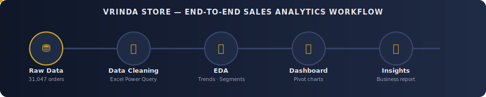
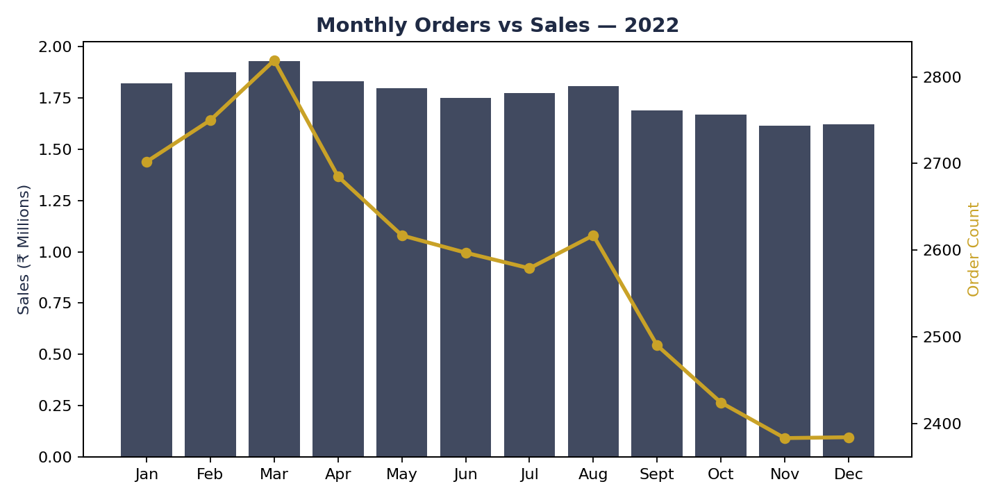
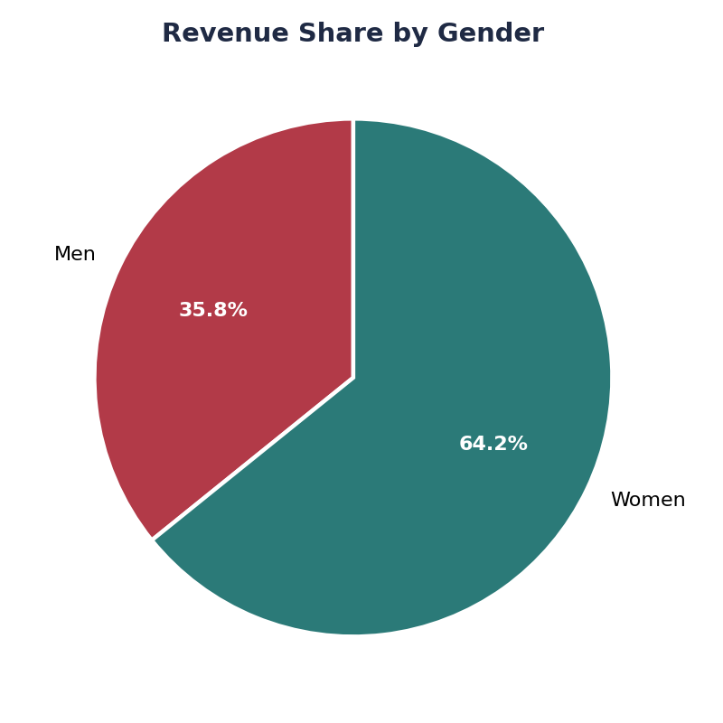
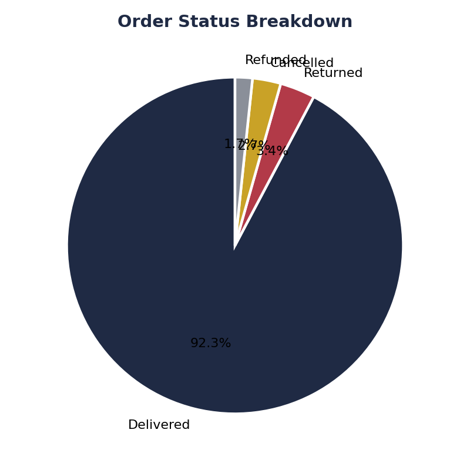
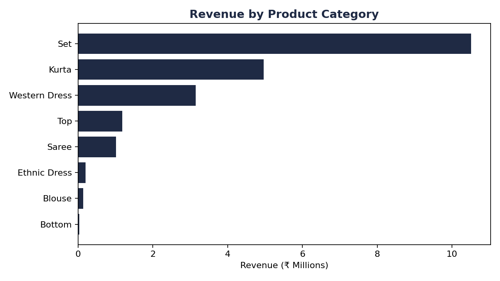
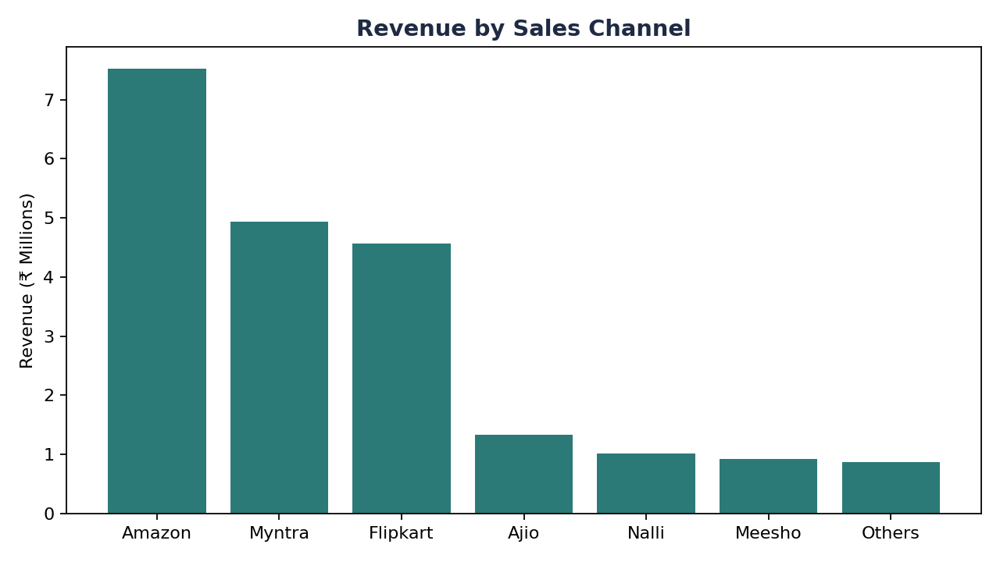

<div align="center">



# 🛍️ Vrinda Store — Sales & Order Analytics (2022)

**End-to-end analysis of 31,000+ e-commerce orders across 7 sales channels**, cleaned with Excel Power Query and visualized with a native Excel pivot dashboard.


</div>

---

## 📌 Problem Statement

Vrinda Store sells ethnic and western wear (Kurtas, Sets, Sarees, Western Dresses) to customers across India through **seven channels** — Amazon, Flipkart, Myntra, Ajio, Nalli, Meesho, and others. In 2022 the business processed **31,047 orders**, but the data existed only as a flat, unstructured transaction log with no derived time fields, no demographic grouping, and no way to answer basic performance questions at a glance.

Management needed clear answers to:

1. **How does demand move through the year**, and where are the peak and slump months?
2. **Who is actually buying** — which gender, age group, and geography drives the most revenue?
3. **Which products and channels** are carrying the business, and which are underperforming?
4. **How healthy is order fulfillment** — what share of orders are cancelled, returned, or refunded rather than delivered?

Without this visibility, inventory planning, channel investment, and marketing spend were being decided on instinct rather than evidence. This project cleans the raw order data in Excel Power Query, engineers the fields needed for time-series and demographic analysis, and turns it into a pivot-chart dashboard and written report that management can act on directly — as shown in the visualizations below.

---

## 🔍 Key Insights *(from the visualizations in this repo)*

| # | Insight | Evidence |
|---|---|---|
| 1 | Revenue peaked in **March** (₹1.93M) and steadily declined toward year-end, bottoming out in **November** (₹1.62M) — a ~16% drop from peak to trough. | `Monthly Orders vs Sales` chart |
| 2 | **Women's wear drives ~64% of total revenue** (₹13.6M) vs. **36%** from menswear (₹7.6M). | `Revenue by Gender` chart |
| 3 | **Sets and Kurtas together account for over 70% of orders**, making them the core inventory to protect against stockouts. | `Revenue by Category` chart |
| 4 | **Amazon is the dominant channel** (~11,000 orders), more than 1.5x the volume of the next-largest channel, Myntra. | `Revenue by Channel` chart |
| 5 | **92.3% of orders are successfully delivered**; cancellations, returns, and refunds together account for ~7.7% of volume — a benchmark worth tracking over time. | `Order Status Breakdown` chart |
| 6 | **Maharashtra, Karnataka, and Uttar Pradesh** are the top three revenue-generating states. | `Top 10 States by Revenue` chart |

---

## 🗂️ Repository Structure

```
vrinda-store-analysis/
├── data/
│   ├── Vrinda_Store_Data_Analysis_raw.xlsx       # Original, unprocessed export
│   └── Vrinda_Store_Data_Analysis_cleaned.xlsx   # Cleaned data + pivot dashboard & charts
├── assets/
│   ├── workflow.svg                              # Animated pipeline banner (above)
│   └── charts/                                   # Chart images used in this README
├── reports/
│   └── Vrinda_Store_Analysis_Report.pdf           # Full written report
└── README.md
```

---

## 🧹 What Was Cleaned

The raw export (`Vrinda_Store_Data_Analysis_raw.xlsx`, 19 columns) was processed into the cleaned workbook using **Excel Power Query**, which:

- Parsed `Date` and derived a **`Month`** column for time-series grouping.
- Bucketed `Age` into an **`Age Group`** field (Teenager / Adult / Senior) for demographic analysis.
- Fed two **pivot tables** (`Order vs Sales` by month, `Amount by Gender`) with native Excel `BarChart` and `PieChart` visualizations on a dedicated report sheet.
- Verified zero missing values across all 31,047 rows before analysis.

## 🛠️ Tools & Stack

- **Microsoft Excel (Power Query)** — data cleaning and field engineering
- **Microsoft Excel** — pivot tables, dashboard, native charts
- **ReportLab** — programmatic PDF report generation

## 📊 Dashboard Preview

<p align="center">
  <br>
  
  <br>
  
  
</p>

## 📄 Full Report

See [`reports/Vrinda_Store_Analysis_Report.pdf`](reports/Vrinda_Store_Analysis_Report.pdf) for the complete write-up: methodology, all findings, and recommendations.

## 🎥 Project Walkthrough

A video walkthrough of the full project is linked inside the workbook (`Project Video Link` sheet).

## 👤 Author

**Hassan Jumaa (Riq)**
Data Analyst | [Portfolio](https://riq-wq.github.io/Myportfolio) · [GitHub](https://github.com/Riq-wq) · [LinkedIn](https://linkedin.com/in/mrisa-juma-56a600416)

---

<div align="center"><sub>Built as part of an independent data analytics portfolio project. Dataset is a public e-commerce reference dataset, extended with additional cleaning, engineered fields, and reporting.</sub></div>
